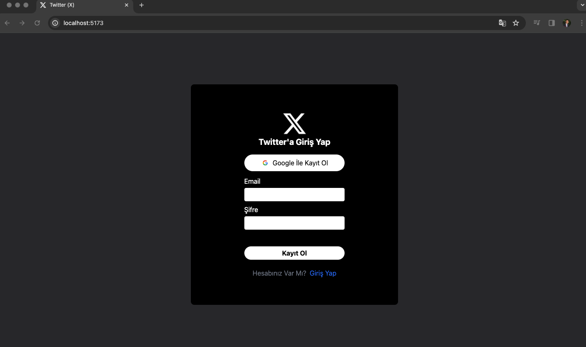
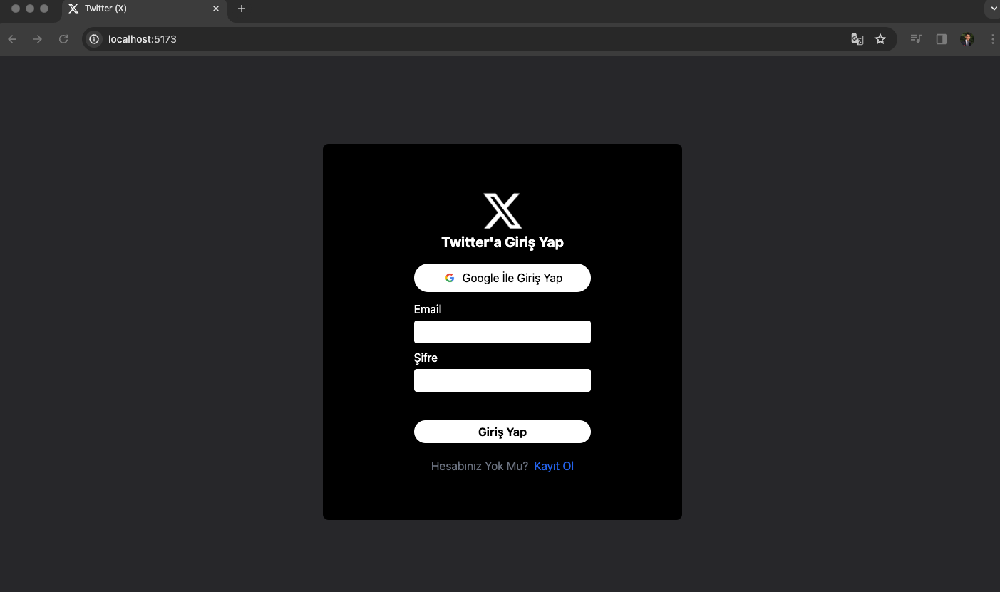
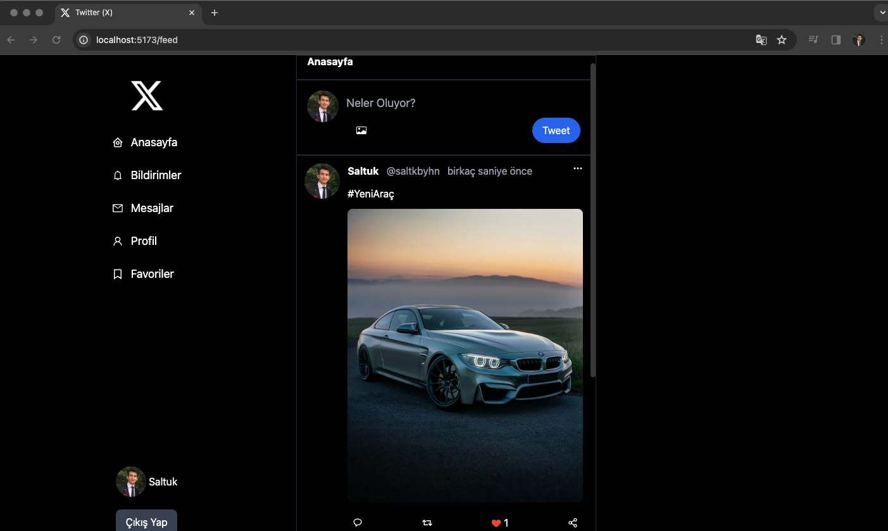
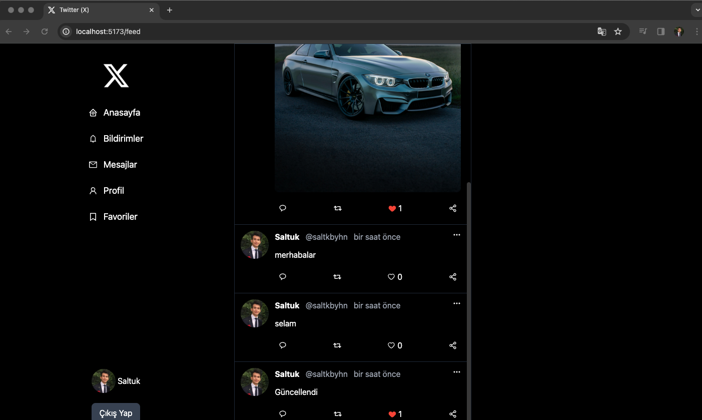
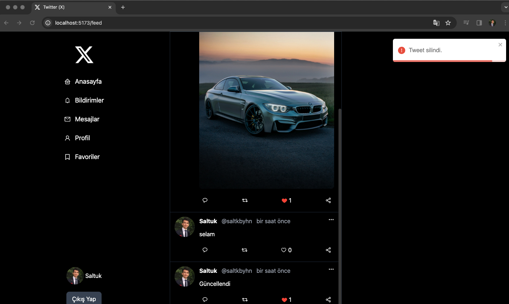
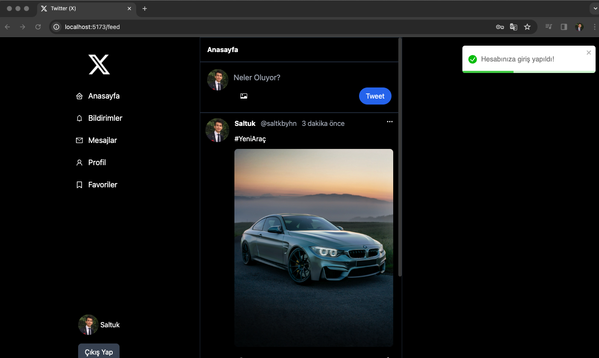
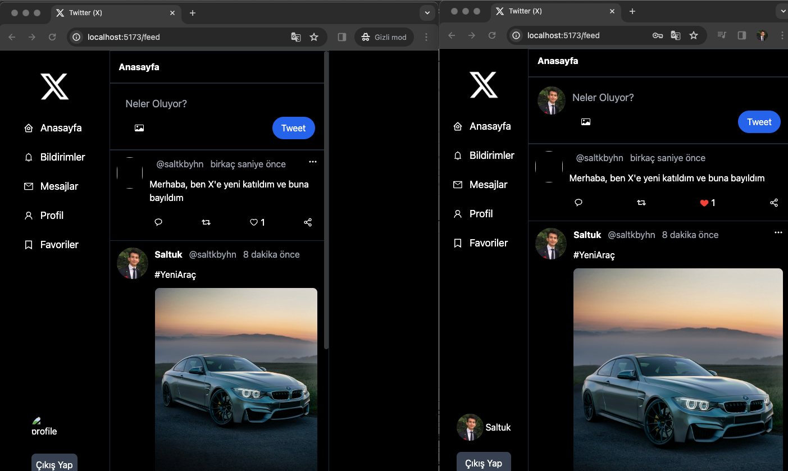

# Twitter (X) Firebase + React + Vite

Bu proje React ile Firebase özellikleri kullanılarak 
oluşturulmuştur. Firebase'in yetkilendirme
ve veri tabanı özellikleri kullanılmıştır.
Hem görsel hem de metin formatında
mention ekleme, silme özellikleri barındırmaktadır.
Google ve kayıt olarak giriş yapma özelliklerine
sahiptir, kullanıcı bilgileri Firebase tarafında 
saklı tutulmaktadır. Arayüz tasarımı Tailwind ile 
oluşturulmuştur. Başka kullanıcılar tarafından
erişim sağlanıp akışa mention ve beğeni gönderilebilmektedir. Tüm bu özellikler
eş zamanlı olarak diğer kullanıcıların anasayfasına 
düşmekte ve güncelliğini korumaktadır.
Kullanıcı deneyimini üst seviye çıkarmak için toastify 
kütüphanesi ile kullanıcıya bildirimler yansıtılmıştır.
Mentionların gönderim zamanları moment kütüphanesi ile
uygun şekle dönüştürülüp Türkçe olarak ekrana yansıtıldı.
Projede bulunan ikonlar için react-icons kullanıldı. 

This template provides a minimal setup to get React working in Vite with HMR and some ESLint rules.

# Kullanılan Kaynaklar

- firebase
- react-router-dom
- react-icons
- moment
- react-toastify
- tailwind

# Ekran Görüntüleri 

# Video 
Video süresi uzun olduğu için Github'a eklenmedi.

# GIF

Currently, two official plugins are available:

- [@vitejs/plugin-react](https://github.com/vitejs/vite-plugin-react/blob/main/packages/plugin-react/README.md) uses [Babel](https://babeljs.io/) for Fast Refresh
- [@vitejs/plugin-react-swc](https://github.com/vitejs/vite-plugin-react-swc) uses [SWC](https://swc.rs/) for Fast Refresh
